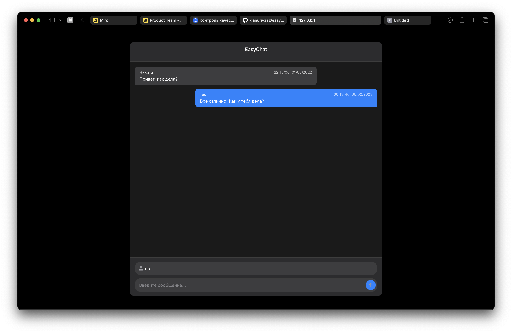

# EasyChat

Лёгкий и элегантный чат на Flask с современным интерфейсом в стиле Apple / iCloud. Приложение использует Flask для бэкенда, jQuery для фронтенда и JSON-файл для хранения сообщений.



## Особенности

- Современный минималистичный дизайн в стиле Apple / iCloud
- Поддержка светлой и темной темы, автоматически на основе системных настроек
- Адаптивный интерфейс для мобильных и десктопных устройств
- Оптимизированная загрузка сообщений с ручным обновлением
- Логирование действий пользователей и системных событий
- Валидация входных данных и обработка ошибок

## Технологии

- **Бэкенд**: Flask, Python
- **Фронтенд**: HTML5, CSS3, JavaScript, jQuery
- **Хранение данных**: JSON
- **Иконки**: Font Awesome

## Установка

### Предварительные требования

- Python 3.6 или выше
- pip, менеджер пакетов Python

### Шаги по установке

1. Клонируйте репозиторий:
   ```bash
   git clone git@github.com:kianurivzzz/easychat.git
   cd easychat
   ```

2. Создай виртуальное окружение, но это рекомендуется:
   ```bash
   python -m venv venv
   source venv/bin/activate  # На Windows: venv\Scripts\activate
   ```

3. Установи зависимости:
   ```bash
   pip install flask
   ```

4. Создай директорию для данных:
   ```bash
   mkdir -p data
   ```

## Запуск

1. Запусти сервер Flask:
   ```bash
   python main.py
   ```

2. Открой браузер и перейдите по адресу:
   ```
   http://localhost:80
   ```

## Структура проекта

```
easychat/
├── chat_templates/        # HTML шаблоны
│   └── index.html         # Основной шаблон чата
├── data/                  # Директория для хранения данных
│   └── db.json            # JSON-файл с сообщениями
├── logs/                  # Логи приложения
├── static/                # Статические файлы
│   └── style.css          # CSS стили
├── .gitignore             # Файлы, игнорируемые Git
├── app.log                # Лог-файл приложения
├── db.py                  # Модуль работы с базой данных
├── main.py                # Основной файл приложения
└── README.md              # Документация проекта
```

## API Endpoints

- `GET /` - Главная страница чата
- `GET /get_messages` - Получение всех сообщений
- `GET /get_message_count` - Получение количества сообщений
- `GET /send_message?name=<имя>&text=<текст>` - Отправка нового сообщения

## Разработка

### Добавление новых функций

1. Форкни репозиторий
2. Создай ветку для новой функции (`git checkout -b feature/amazing-feature`)
3. Внеси изменения и закоммитьте их (`git commit -m 'Add some amazing feature'`)
4. Отправь изменения в ваш форк (`git push origin feature/amazing-feature`)
5. Создай Pull Request

## Контакты

Никита – [hello@nkarasyov.ru](mailto:hello@nkarasyov.ru)

Ссылка на проект: [https://github.com/kianurivzzz/easychat](https://github.com/kianurivzzz/easychat)
